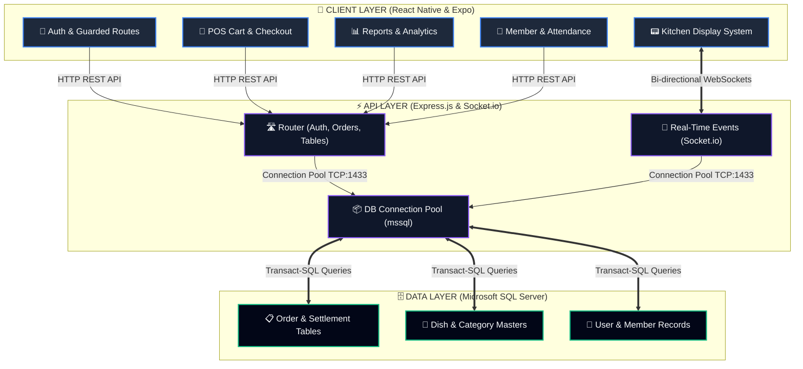
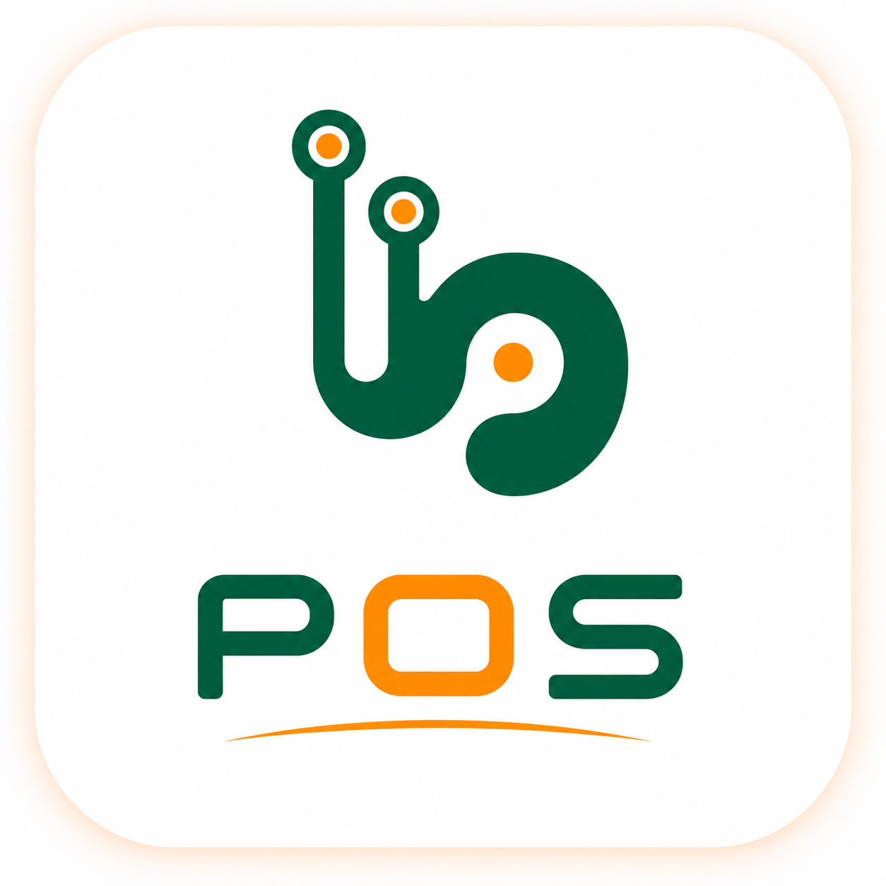

# 🍽️ UCS PONDY - Restaurant POS System
### *A Next-Generation, Real-Time Point of Sale and Kitchen Management Solution*

---


---

## 🌟 SYSTEM OVERVIEW
The **UCS PONDY Restaurant POS System** is an enterprise-grade, high-performance solution designed to streamline restaurant operations, enhance kitchen coordination, and provide deep analytical insights into sales. By combining a real-time mobile/tablet frontend, an asynchronous event-driven backend, and a robust relational data model, it bridges the gap between front-of-house service and back-of-house food preparation.



---

## 📸 PRODUCT GALLERY

````carousel

<!-- slide -->

<!-- slide -->
### 🛠️ Architecture Stack
* **Frontend**: React Native, Expo SDK, Zustand State Management, TypeScript
* **Backend**: Node.js, Express.js Server, Socket.io for WebSockets
* **Database**: Microsoft SQL Server (MSSQL), Optimized Query Pools
````

---

## ⚡ KEY FEATURES & CAPABILITIES

### 1. 🛒 Point-of-Sale (POS) & Checkout Engine
* **Interactive Cart & Menu Grid**: Browse dishes by dynamically loaded categories. Add custom modifiers, adjust quantities, and manage the cart smoothly.
* **Table & Seating Management**: Real-time visual tracking of table availability, seating capacities, and waiter allocation.
* **Multi-Mode Payment Settlement**: Supports cash, cards, UPI/wallets, and customer credit ledger accounts.
* **Smart Calculation Engine**: Automatically calculates local GST, custom service charges, and discount schemas, with immediate PDF invoice creation via the [BillPDFGenerator](frontend/components/BillPDFGenerator.ts).

### 2. 📟 Kitchen Display System (KDS)
* **Zero-Latency Syncing**: Uses Socket.io to push newly created orders directly to kitchen tablets.
* **Interactive Queue Management**: Chefs can view pending items grouped by table, mark them "In Preparation", and signal waiters when items are "Ready to Serve".
* **Audio Alerts**: Instant sound notifications keep the kitchen team updated when new orders land.

### 3. 👥 Member & Loyalty Program
* **Customer Ledgers**: Keep detailed profile records (names, contact details, tags).
* **Credit Facilities**: Configure credit limits and current balances per member. Safely settle restaurant orders against a member's pre-approved credit balance.

### 4. ⏰ Employee Attendance & Shift Tracking
* **Smart Check-in**: Employees check in/out of shifts directly from the terminal.
* **Shift Reports**: Auto-calculate working hours, break durations, and shifts directly connected with back-office payroll workflows.

### 5. 📊 Back-Office Analytics & Reports
* **Live Dashboards**: Track net sales, total checkouts, and popular items in real-time.
* **Granular Time Filtering**: Generate daily sales reports, weekly trends, and historical date range summaries.
* **Secure Exporting**: Export sales, inventory, and settlement tables to CSV or PDF for clean bookkeeping.

---

## 🛠️ MODERN ARCHITECTURE & DESIGN

### 💻 Frontend Architecture (React Native & Zustand)
The client interface is designed for speed and reliability, featuring:
* **Guarded Routing Layouts**: Built-in authentication routes restrict access based on employee roles (`ADMIN`, `CASHIER`, `WAITER`, `KDS`).
* **Unidirectional State Flow**: Powered by Zustand for predictable, reactive UI updates that ensure the cart, tables, and settings remain in sync without heavy render overhead.
* **Robust PDF Renderer**: Implements a dedicated [BillPDFGenerator](frontend/components/BillPDFGenerator.ts) component that formats receipts dynamically for thermal or A4 printers.

### ⚙️ Backend & API Engine (Node.js & Express)
* **High Concurrency Database Pooling**: Powered by `mssql` connection pooling configured to support high-traffic peak hours without dropping requests.
* **Dynamic Database Migrations**: Automatic table generation and database schema initialization on startup.
* **Real-time Event Hub**: Built-in Socket.io server coordinates instantaneous communications between POS terminals, tables, and KDS devices.

---

> [!NOTE]
> ### 🚀 System Scalability & Flexibility
> The architecture supports seamless hardware integration with thermal printers, bar-code scanners, kitchen display tablets, and portable waiter handsets, providing a unified digital footprint for modern dining venues.

> [!TIP]
> ### 🔐 Security and Performance Recommendation
> For production deployments, it is highly recommended to secure all route endpoints with JWT validation middleware, migrate plaintext passwords to hashed formats using `bcrypt`, and establish appropriate indexes on table lookup keys to guarantee rapid search speeds.
